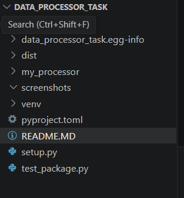
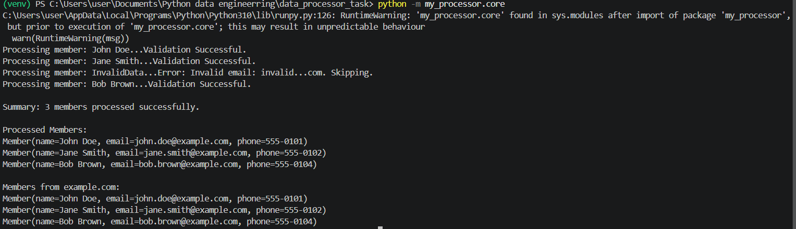
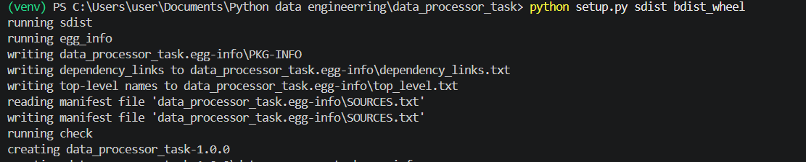
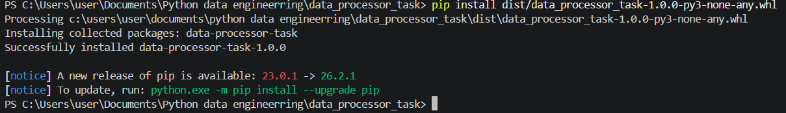
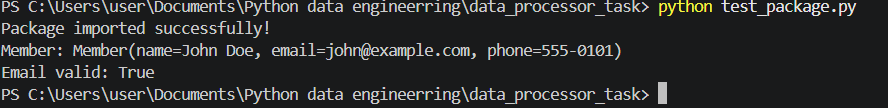

# Data Processor Task

A Python package for member data processing and validation. This training project demonstrates best practices for data validation, custom exceptions, and package distribution.

---

## Table of Contents

- [Overview](#overview)
- [Features](#features)
- [Installation](#installation)
- [Quick Start](#quick-start)
- [API Reference](#api-reference)
- [Validation Rules](#validation-rules)
- [Examples](#examples)
- [Project Structure](#project-structure)
- [Testing](#testing)
- [Screenshots](#screenshots)

---

## Overview

`data_processor_task` is a lightweight Python package that processes and validates member records. It provides robust validation for common data fields (name, email, phone) and includes utilities for cleaning, formatting, and filtering member data.

This project showcases:
- Clean data validation patterns
- Custom exception handling
- Python package structure and distribution
- Module organization best practices

---

## Features

**Data Validation**
- Validate and normalize member fields
- Enforce required fields (`name`, `email`, `phone`)
- Email format validation with regex patterns
- Phone number format validation

**Data Processing**
- Clean and strip whitespace from input
- Truncate names to 50 characters automatically
- Filter members by email domain
- Skip invalid records gracefully

**Error Handling**
- Custom `InvalidMemberDataError` exception
- Detailed error messages for debugging
- Graceful handling of missing fields

**Easy Distribution**
- Wheel package support
- Standard Python packaging (setuptools)
- Compatible with pip install

---

## Requirements

- **Python:** 3.8 or higher

---

## Installation

### Option 1: Install from local source

```bash
pip install .
```

### Option 2: Install in development mode

For development and testing:

```bash
pip install -e .
```

### Option 3: Build and install a wheel

```bash
python -m pip install wheel
python setup.py bdist_wheel
pip install dist/data_processor_task-1.0.0-py3-none-any.whl
```

---

## Quick Start

### Basic Usage

```python
from my_processor.core import process_members
from my_processor.utils import InvalidMemberDataError

# Define raw member data
raw_members = [
    {"name": "John Doe", "email": "john.doe@example.com", "phone": "555-0101"},
    {"name": "Jane Smith", "email": "jane.smith@example.com", "phone": "555-0102"},
    {"name": "Bob Johnson", "email": "bob.johnson@company.org", "phone": "555-0103"}
]

# Process members (invalid records are skipped automatically)
processed = process_members(raw_members)

# Use processed members
for member in processed:
    print(member)
```

### Run the included example

```bash
python -m my_processor.core
```

---

## API Reference

### Core Classes

#### `Member`

Represents a validated member record.

```python
class Member:
    def __init__(self, name: str, email: str, phone: str)
```

**Attributes:**
- `name` (str): Member's full name (max 50 characters)
- `email` (str): Member's email address
- `phone` (str): Member's phone number (format: XXX-XXXX)

**Example:**
```python
member = Member("John Doe", "john@example.com", "555-0101")
print(member)  # Output: Member(name=John Doe, email=john@example.com, phone=555-0101)
```

---

### Core Functions

#### `process_member(raw_member: dict) -> Member`

Process and validate a single member record.

```python
from my_processor.core import process_member

raw_data = {"name": "Alice", "email": "alice@example.com", "phone": "555-1234"}
member = process_member(raw_data)
```

**Raises:** `InvalidMemberDataError` if validation fails

---

#### `process_members(raw_members: list) -> list[Member]`

Process multiple member records with error handling and reporting.

```python
from my_processor.core import process_members

members = process_members(raw_data_list)
print(f"Successfully processed {len(members)} members")
```

**Note:** Invalid records are logged and skipped; processing continues for valid records

---

### Utility Functions

#### `clean_string(value: str) -> str`

Remove leading/trailing whitespace from a string.

```python
from my_processor.utils import clean_string

clean_string("  John Doe  ")  # Returns: "John Doe"
```

---

#### `validate_email(email: str) -> bool`

Check if email format is valid.

```python
from my_processor.utils import validate_email

validate_email("user@example.com")  # Returns: True
validate_email("invalid.email")     # Returns: False
```

---

#### `validate_phone(phone: str) -> bool`

Check if phone number format is valid (XXX-XXXX).

```python
from my_processor.utils import validate_phone

validate_phone("555-0101")  # Returns: True
validate_phone("5550101")   # Returns: False
```

---

#### `format_phone(phone: str) -> str`

Remove dashes from phone number.

```python
from my_processor.utils import format_phone

format_phone("555-0101")  # Returns: "5550101"
```

---

#### `filter_members_by_email(members: list, domain: str) -> list[Member]`

Filter members by email domain.

```python
from my_processor.utils import filter_members_by_email

company_members = filter_members_by_email(processed_members, "example.com")
```

---

### Exceptions

#### `InvalidMemberDataError`

Custom exception raised when member data validation fails.

```python
from my_processor.utils import InvalidMemberDataError

try:
    member = process_member({"name": "", "email": "test@example.com", "phone": "555-0101"})
except InvalidMemberDataError as e:
    print(f"Validation error: {e}")
```

---

## Validation Rules

| Field | Rule | Example |
|-------|------|---------|
| **name** | Non-empty string, max 50 characters | "John Doe" |
| **email** | Valid email format (pattern: `[\w\.-]+@[\w\.-]+\w+`) | "john@example.com" |
| **phone** | Format XXX-XXXX (3 digits, dash, 4 digits) | "555-0101" |

**Note:** All fields are required. Missing fields raise `InvalidMemberDataError`.

---

## Examples

### Example 1: Process and display members

```python
from my_processor.core import process_members

members_data = [
    {"name": "Alice Wonder", "email": "alice@techcorp.com", "phone": "555-1001"},
    {"name": "Bob Builder", "email": "bob@techcorp.com", "phone": "555-1002"},
]

members = process_members(members_data)
for member in members:
    print(f"✓ {member.name:20} | {member.email:25} | {member.phone}")
```

**Output:**
```
Processing member: Alice Wonder...✓
Processing member: Bob Builder...✓
✓ Alice Wonder           | alice@techcorp.com       | 555-1001
✓ Bob Builder            | bob@techcorp.com        | 555-1002
```

---

### Example 2: Handle validation errors

```python
from my_processor.core import process_member
from my_processor.utils import InvalidMemberDataError

# Missing email field
try:
    member = process_member({"name": "Charlie", "phone": "555-1003"})
except InvalidMemberDataError as e:
    print(f"Error: {e}")
```

**Output:**
```
Error: Missing required field: 'email'
```

---

### Example 3: Filter by email domain

```python
from my_processor.core import process_members
from my_processor.utils import filter_members_by_email

members_data = [
    {"name": "Alice", "email": "alice@company.com", "phone": "555-1001"},
    {"name": "Bob", "email": "bob@other.org", "phone": "555-1002"},
    {"name": "Charlie", "email": "charlie@company.com", "phone": "555-1003"},
]

all_members = process_members(members_data)
company_members = filter_members_by_email(all_members, "company.com")

print(f"Company members: {len(company_members)}")
for member in company_members:
    print(f"  - {member.name}")
```

---

## Project Structure

```
data_processor_task/
├── my_processor/              # Main package
│   ├── __init__.py           # Package initialization and exports
│   ├── core.py               # Core processing logic (Member, process_member)
│   └── utils.py              # Validation and utility functions
├── test_package.py           # Package testing script
├── setup.py                  # Setup configuration (setuptools)
├── pyproject.toml            # Build system metadata
├── README.md                 # This file
├── build/                    # Build artifacts (generated)
├── dist/                     # Distribution files (generated)
└── screenshots/              # Project documentation images
```

---

## Testing

Test the package with the included test script:

```bash
python test_package.py
```

Or import and test interactively:

```python
from my_processor.core import process_members
from my_processor.utils import validate_email, validate_phone

# Test validation functions
assert validate_email("test@example.com") == True
assert validate_phone("555-0101") == True
print("All tests passed!")
```

---

## Package Distribution

### Build a wheel

```bash
python -m pip install wheel
python setup.py bdist_wheel
```

Output: `dist/data_processor_task-1.0.0-py3-none-any.whl`

### Build source distribution

```bash
python setup.py sdist
```

Output: `dist/data_processor_task-1.0.0.tar.gz`

### Install from wheel

```bash
pip install dist/data_processor_task-1.0.0-py3-none-any.whl
```

---

## Screenshots

### Folder Structure


### Application Execution


### Wheel Creation


### Wheel Installation


### Package Import


---
